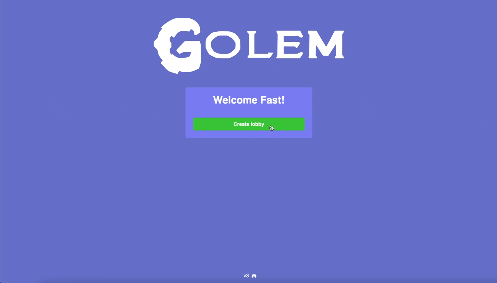
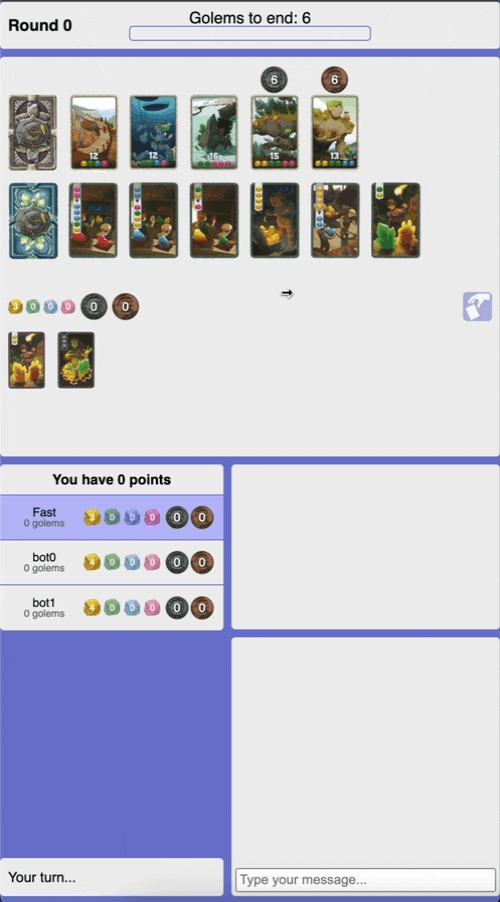
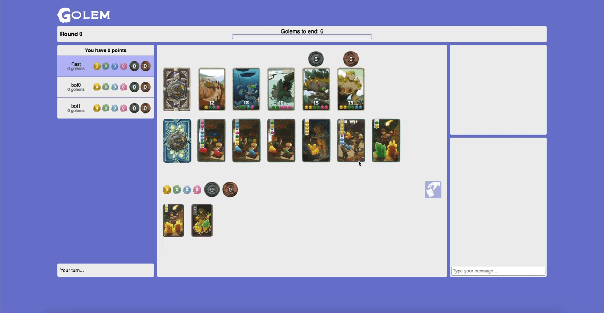

# Golem

Play at https://golem.lol

In Golem, players delve into a captivating world of trade and strategy. As traders navigating a bustling realm, your journey involves skillfully acquiring merchant cards to produce valuable crystals. These crystals, in turn, become the currency used to purchase powerful golems. The game revolves around mastering the delicate balance of resource management and strategic decision-making. Golem offers an immersive experience with its intuitive interface, where players engage in clever hand-building mechanics, make strategic choices, and strive to become the ultimate master trader in this captivating digital realm.

## Reponsive Views
Mobile                                |  Laptop
:------------------------------------:|:-------------------------:
  |  

## v1 Features
1. Game implementation
2. Game history
3. Multiplayer with lobbies

## v2 Features
1. Revamped and Responsive UI
2. Sessions that allow users to disconnect and reconnect to their games

## v3 Features
1. Conversion to TypeScript
2. Bots